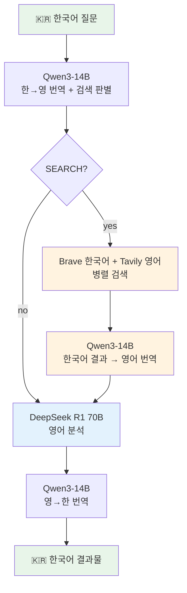
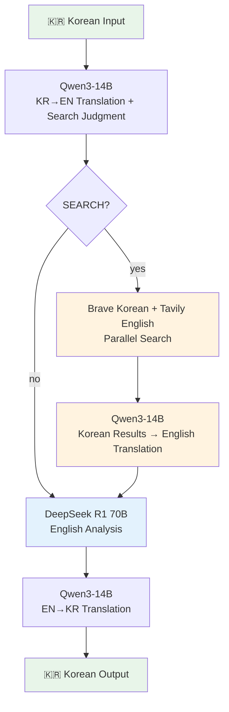

# local-llm-pipeline

[English](#english) | [한국어](#한국어)

---

## 한국어

MacBook Pro M5 Max (128GB)에서 로컬 LLM 삼단 파이프라인.

Qwen3-14B가 한국어를 영어로 번역 → DeepSeek R1 70B가 영어로 분석 → Qwen3-14B가 다시 한국어로 번역. 두 모델을 동시에 메모리에 올려 **모델 스왑 없이** 중국어/일본어 한자 혼입 없는 순수 한글 결과물을 생성.

**웹 검색 통합**: Qwen3-14B가 번역 시 검색 필요 여부를 자동 판별. 검색이 필요하면 Brave Search (한국어) + Tavily (영어)를 병렬 실행하여 최신 정보를 DeepSeek 분석에 주입.

### 장비 스펙

| 항목 | 사양 |
|------|------|
| 모델 | MacBook Pro (Mac17,6) |
| 칩 | Apple M5 Max |
| 메모리 | 128GB Unified Memory |
| 스토리지 | 4TB SSD |
| 메모리 대역폭 | 614 GB/s |
| OS | macOS 15 (Sequoia) |

### 구조

> 동시 로딩: DeepSeek R1 70B (~75GB) + Qwen3-14B (~7.7GB) = ~83GB / 128GB



### 왜 이 조합인가 — 의사결정 과정

**1. Ollama vs LM Studio vs mlx-lm**

처음에 Ollama를 설치했으나, M5 Max에서 Metal 백엔드 크래시 발생 ([ollama#14432](https://github.com/ollama/ollama/issues/14432)). LM Studio의 MLX 백엔드로 전환하여 동작을 확인한 후, mlx-lm을 직접 사용하는 방식으로 최종 전환. LM Studio는 동시에 하나의 모델만 로딩하는 제약이 있었으나, mlx-lm 직접 사용 시 복수 모델 동시 로딩 가능. (참고: Ollama Metal 크래시는 `brew install ollama`(소스 컴파일)에서만 발생하며, `brew install --cask ollama`(프리빌트 바이너리)로 설치하면 정상 동작 확인됨.)

**2. 모델 선택 — 분석 용도**

128GB 메모리에서 돌릴 수 있는 분석용 모델을 비교:

| 모델 | 양자화 | 메모리 | 분석력 | 한국어 | 선택 |
|------|--------|--------|--------|--------|------|
| Qwen 3 32B | 4-bit | ~18GB | A | A | 메모리 낭비 |
| Qwen 2.5 72B | 8-bit | ~75GB | A | A+ | 분석 깊이 부족 |
| DeepSeek R1 70B | 8-bit | ~75GB | **S** | B+ | **채택** |
| Mistral Large 123B | 4-bit | ~70GB | A+ | B- | 범용이라 R1보다 분석 약함 |
| Qwen 3 235B-A22B | 4-bit | ~130GB | S+ | A | 128GB에 안 들어감 |

**3. 삼단 파이프라인 — 듀얼에서 진화**

초기에는 DeepSeek 분석 → Qwen 3 32B 번역의 이단 파이프라인이었으나, 세 가지 문제를 발견:

- **모델 스왑**: LM Studio가 한 모델만 로딩 → ~10초 스왑 오버헤드
- **한국어 입력**: DeepSeek R1이 mlx-lm에서 한국어 입력을 무시 (chat template 이슈)
- **한자 혼입 위험**: Qwen3 32B/27B도 중국어 혼입 가능성 존재 (Qwen3.5-27B에서 `扬长而去` 혼입 확인)

해결: 작은 번역 전용 모델(Qwen3-14B, ~7.7GB)을 도입하여 DeepSeek과 동시 로딩. 한국어 입력을 먼저 영어로 번역해서 DeepSeek에 전달하고, 결과를 다시 한국어로 번역.

**4. 번역 모델 선택 — Qwen3-14B 4-bit**

10개 테스트 항목(일상, 속담, 기술 문서, 구어, 비즈니스, 뉴스체)으로 비교:

| 모델 | 메모리 | 번역 품질 | 한자 혼입 | 선택 |
|------|--------|-----------|-----------|------|
| Qwen3-8B 4-bit | 4.3GB | B+ | 0건 | 문화 표현 오역 ("치맥"→"hot pot") |
| **Qwen3-14B 4-bit** | **7.7GB** | **A** | **0건** | **채택** |
| Qwen3-14B 8-bit | 14.6GB | A | 0건 | 메모리 대비 소폭 개선 |
| Qwen3.5-27B 4-bit | 14.1GB | A+ | **1건** ❌ | 중국어 성어 혼입 |

Qwen3-14B 4-bit: 번역 품질과 한자 안전성의 최적 균형. DeepSeek과 합산 ~83GB로 128GB에 여유 ~30GB.

### 요구 사항

- macOS + Apple Silicon (M-series)
- Python 3.10+
- mlx-lm: `pip install mlx-lm`
- 모델 (자동 다운로드 또는 수동):
  - DeepSeek R1 70B: `mlx-community/DeepSeek-R1-Distill-Llama-70B-8bit` (~75GB)
  - Qwen3-14B: `mlx-community/Qwen3-14B-4bit` (~7.7GB)
- 웹 검색 API 키 (선택 — 미설정 시 검색 단계 건너뜀):
  - `BRAVE_API_KEY`: [Brave Search API](https://brave.com/search/api/)
  - `TAVILY_API_KEY`: [Tavily API](https://tavily.com/)

### 사용법

```bash
# venv 설정 (최초 1회)
python3 -m venv .venv && source .venv/bin/activate && pip install mlx-lm

# 웹 검색 API 키 설정 (선택)
export BRAVE_API_KEY="your-brave-api-key"
export TAVILY_API_KEY="your-tavily-api-key"

# 삼단 파이프라인 (한국어 입력 → 영어 분석 → 한국어 결과)
python3 mlx-pipeline.py "인공지능이 노동 시장에 미치는 영향을 분석해줘"

# 대화형 모드 (컨텍스트 유지 — 후속 질문 가능)
python3 mlx-pipeline.py
# 대화 중 /reset 으로 컨텍스트 초기화

# 웹 검색 강제 실행
# /search 최근 애플 실적 분석해줘

# 웹 검색 건너뛰기
# /nosearch 인공지능의 철학적 의미를 분석해줘

# DeepSeek만 (영어 입출력)
python3 mlx-pipeline.py --deepseek-only "Analyze the impact of AI on labor markets"

# Qwen만 (한국어 대화)
python3 mlx-pipeline.py --qwen-only "오늘 할 일 정리해줘"

# 번역만 (분석 없이)
python3 mlx-pipeline.py --translate-only "번역할 문장"
```

### 제한 사항

- DeepSeek R1은 "thinking" 시간이 있어 복잡한 질문일수록 응답 지연
- Qwen 번역은 기능적 수준 (전문 번역가 수준은 아님, 하지만 의미 전달 충분)
- 최초 실행 시 모델 다운로드 필요 (~83GB)
- ~~Ollama는 M5 Max Metal 크래시 이슈로 사용 불가~~ → `brew install --cask ollama`로 설치 시 정상 동작 확인 ([ollama#14432](https://github.com/ollama/ollama/issues/14432))

### LM Studio 버전 (레거시)

LM Studio API를 사용하는 이전 버전도 유지:

```bash
# LM Studio 서버 실행 필요 (localhost:1234)
python3 llm-pipeline.py "질문"
```

---

## English

Triple-stage local LLM pipeline on MacBook Pro M5 Max (128GB).

Qwen3-14B translates Korean to English → DeepSeek R1 70B analyzes in English → Qwen3-14B translates back to Korean. Both models stay loaded simultaneously — **zero model swap** — producing pure Hangul output without Chinese/Japanese character contamination.

**Web search integration**: Qwen3-14B automatically judges whether a web search is needed during translation. When needed, Brave Search (Korean) + Tavily (English) run in parallel, injecting up-to-date information into DeepSeek's analysis.

### Hardware

| Spec | Value |
|------|-------|
| Machine | MacBook Pro (Mac17,6) |
| Chip | Apple M5 Max |
| Memory | 128GB Unified Memory |
| Storage | 4TB SSD |
| Memory Bandwidth | 614 GB/s |
| OS | macOS 15 (Sequoia) |

### Architecture

> Loaded simultaneously: DeepSeek R1 70B (~75GB) + Qwen3-14B (~7.7GB) = ~83GB / 128GB



### Decision Log

**1. Ollama vs LM Studio vs mlx-lm**

Initially installed Ollama, but it crashes on M5 Max due to a Metal backend issue ([ollama#14432](https://github.com/ollama/ollama/issues/14432)). Switched to LM Studio's MLX backend, then to direct mlx-lm usage for simultaneous multi-model loading (LM Studio limited to one model at a time). (Note: The Ollama Metal crash only occurs with `brew install ollama` (source build). Installing via `brew install --cask ollama` (pre-built binary) works correctly.)

**2. Model Selection — Analysis**

| Model | Quant | Memory | Analysis | Korean | Decision |
|-------|-------|--------|----------|--------|----------|
| Qwen 3 32B | 4-bit | ~18GB | A | A | Underutilizes hardware |
| Qwen 2.5 72B | 8-bit | ~75GB | A | A+ | Insufficient analysis depth |
| DeepSeek R1 70B | 8-bit | ~75GB | **S** | B+ | **Selected** |
| Mistral Large 123B | 4-bit | ~70GB | A+ | B- | General-purpose, weaker than R1 |
| Qwen 3 235B-A22B | 4-bit | ~130GB | S+ | A | Doesn't fit in 128GB |

**3. Triple-Stage Pipeline — Evolution from Dual**

The initial dual pipeline (DeepSeek → Qwen 32B translation) had three problems:

- **Model swap**: LM Studio loads one model at a time → ~10s swap overhead
- **Korean input**: DeepSeek R1 ignores Korean input in mlx-lm (chat template issue)
- **Character contamination risk**: Qwen 32B/27B can also leak Chinese characters (confirmed `扬长而去` in Qwen3.5-27B output)

Solution: introduce a small translator model (Qwen3-14B, ~7.7GB) loaded alongside DeepSeek. Korean input is translated to English first, then analyzed, then translated back.

**4. Translation Model — Qwen3-14B 4-bit**

Tested across 10 categories (daily, proverbs, technical docs, slang, business, news):

| Model | Memory | Quality | Contamination | Decision |
|-------|--------|---------|---------------|----------|
| Qwen3-8B 4-bit | 4.3GB | B+ | 0 cases | Mistranslated cultural terms |
| **Qwen3-14B 4-bit** | **7.7GB** | **A** | **0 cases** | **Selected** |
| Qwen3-14B 8-bit | 14.6GB | A | 0 cases | Marginal gain for 2x memory |
| Qwen3.5-27B 4-bit | 14.1GB | A+ | **1 case** ❌ | Chinese idiom leaked |

### Requirements

- macOS + Apple Silicon (M-series)
- Python 3.10+
- mlx-lm: `pip install mlx-lm`
- Models (auto-downloaded or manual):
  - DeepSeek R1 70B: `mlx-community/DeepSeek-R1-Distill-Llama-70B-8bit` (~75GB)
  - Qwen3-14B: `mlx-community/Qwen3-14B-4bit` (~7.7GB)
- Web search API keys (optional — search step skipped gracefully if missing):
  - `BRAVE_API_KEY`: [Brave Search API](https://brave.com/search/api/)
  - `TAVILY_API_KEY`: [Tavily API](https://tavily.com/)

### Usage

```bash
# Setup (once)
python3 -m venv .venv && source .venv/bin/activate && pip install mlx-lm

# Web search API keys (optional)
export BRAVE_API_KEY="your-brave-api-key"
export TAVILY_API_KEY="your-tavily-api-key"

# Triple-stage pipeline (Korean → English analysis → Korean)
python3 mlx-pipeline.py "Analyze the impact of AI on labor markets"

# Interactive mode (context preserved — follow-up questions work)
python3 mlx-pipeline.py
# Type /reset during conversation to clear context

# Force web search
# /search Analyze recent Apple earnings

# Skip web search
# /nosearch Analyze the philosophical meaning of AI

# DeepSeek only (English in/out)
python3 mlx-pipeline.py --deepseek-only "question"

# Qwen only (Korean conversation)
python3 mlx-pipeline.py --qwen-only "질문"

# Translation only (no analysis)
python3 mlx-pipeline.py --translate-only "text to translate"
```

### Limitations

- DeepSeek R1 has "thinking" latency — longer for complex queries
- Qwen translation is functional, not professional-grade (but sufficient for comprehension)
- First run downloads ~83GB of model weights
- ~~Ollama unusable on M5 Max due to Metal crash~~ → works with `brew install --cask ollama` (pre-built binary) ([ollama#14432](https://github.com/ollama/ollama/issues/14432))

### LM Studio Version (Legacy)

The previous LM Studio API version is preserved:

```bash
# Requires LM Studio server running at localhost:1234
python3 llm-pipeline.py "question"
```

## License

MIT
