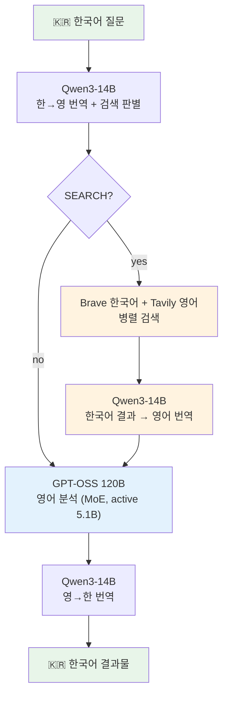
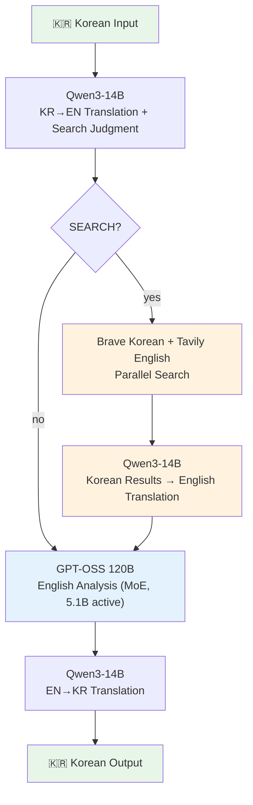

# local-llm-pipeline

[English](#english) | [한국어](#한국어)

---

## 한국어

MacBook Pro M5 Max (128GB)에서 로컬 LLM 파이프라인.

**두 가지 파이프라인 제공:**

1. **mlx-pipeline** (삼단): Qwen3-14B (번역) + GPT-OSS 120B (분석). 모델 스왑 없이 동시 로딩. 한자 혼입 없는 순수 한글 결과물 생성.
2. **multimodal** (단일 모델): Gemma 4 31B. 텍스트+이미지 멀티모달 분석. 한국어 네이티브 지원으로 번역 불필요. 검색 쿼리 자동 리라이팅 + 날짜 인식.

**웹 검색 통합**: 두 파이프라인 모두 Brave Search (한국어) + Tavily (영어) 병렬 검색 지원. 검색 필요 여부 자동 판별.

### 장비 스펙

| 항목 | 사양 |
|------|------|
| 모델 | MacBook Pro (Mac17,6) |
| 칩 | Apple M5 Max |
| 메모리 | 128GB Unified Memory |
| 스토리지 | 4TB SSD |
| 메모리 대역폭 | 614 GB/s |
| OS | macOS 26.5.1 |

### 구조

> 동시 로딩: GPT-OSS 120B (~65GB) + Qwen3-14B (~7.7GB) = ~73GB / 128GB


```mermaid
flowchart TD
    A["🇰🇷 한국어 질문"] --> B["Qwen3-14B<br/>한→영 번역 + 검색 판별"]
    B --> C{SEARCH?}
    C -->|yes| D["Brave 한국어 + Tavily 영어<br/>병렬 검색"]
    C -->|no| E["GPT-OSS 120B<br/>영어 분석 (MoE, active 5.1B)"]
    D --> D2["Qwen3-14B<br/>한국어 결과 → 영어 번역"]
    D2 --> E
    E --> F["Qwen3-14B<br/>영→한 번역"]
    F --> G["🇰🇷 한국어 결과물"]

    style A fill:#e8f5e9
    style G fill:#e8f5e9
    style D fill:#fff3e0
    style D2 fill:#fff3e0
    style E fill:#e3f2fd
```

### 설계 근거

> 바로 돌려보려면 [사용법](#사용법)으로 건너뛰세요.

**1. 런타임 — mlx-lm 직접 사용**

mlx-lm을 직접 호출합니다. LM Studio는 한 번에 한 모델만 로딩하므로 번역 모델과 추론 모델을 동시에 올릴 수 없고(스왑 시 ~10초 오버헤드), Ollama는 M5 Max에서 Metal 백엔드 크래시가 있습니다 ([ollama#14432](https://github.com/ollama/ollama/issues/14432) — `brew install ollama`(소스 빌드) 한정이며 `brew install --cask ollama`(프리빌트 바이너리)는 정상 동작).

**2. 모델 선택 — 분석 용도**

128GB 메모리에서 돌릴 수 있는 분석용 모델을 비교:

| 모델 | 양자화 | 메모리 | 분석력 | 한국어 | 선택 |
|------|--------|--------|--------|--------|------|
| Qwen 3 32B | 4-bit | ~18GB | A | A | 메모리 낭비 |
| DeepSeek R1 Distill 70B | 8-bit | ~75GB | A+ | B+ | dense 70B, think 블록 장황, MMLU-Pro ~80 |
| **GPT-OSS 120B** | **4-bit** | **~65GB** | **S** | **B+** | **채택** (MoE, active 5.1B, MMLU-Pro 90.0, 128K 컨텍스트) |
| Mistral Large 123B | 4-bit | ~70GB | A+ | B- | 범용이라 분석 특화 약함 |
| Qwen 3.5 122B-A10B | 4-bit | ~60GB | A+ | B | MoE 대안 — 영어 추론 GPT-OSS 우위 |
| Qwen 3 235B-A22B | 4-bit | ~130GB | S+ | A | 128GB에 안 들어감 |

> 분석력·한국어 열은 자체 테스트에 기반한 주관 등급입니다. MMLU-Pro·AIME는 공개 벤치마크 수치.

GPT-OSS 120B는 MoE(active 5.1B)라 dense 70B보다 토큰당 추론이 빠르고, harmony `analysis` 채널이 `<think>` 블록보다 간결합니다.

**3. 왜 삼단인가 — 번역 래퍼**

추론 모델에 한국어를 직접 넣지 않고, 번역 전용 Qwen3-14B(~7.7GB)를 추론 모델과 함께 올립니다. 두 가지 제약 때문입니다:

- **한국어 입력**: GPT-OSS는 한국어 네이티브가 아니며, mlx-lm에서 한국어 입력을 제대로 처리하지 못함
- **한자 혼입**: 번역까지 큰 모델에 맡기면 중국어가 섞임 (Qwen3.5-27B 출력에서 `扬长而去` 확인)

한국어 질문을 영어로 번역해 추론 모델에 전달하고, 결과를 다시 한국어로 번역합니다.

**4. 번역 모델 선택 — Qwen3-14B 4-bit**

10개 테스트 항목(일상, 속담, 기술 문서, 구어, 비즈니스, 뉴스체)으로 비교:

| 모델 | 메모리 | 번역 품질 | 한자 혼입 | 선택 |
|------|--------|-----------|-----------|------|
| Qwen3-8B 4-bit | 4.3GB | B+ | 0건 | 문화 표현 오역 ("치맥"→"hot pot") |
| **Qwen3-14B 4-bit** | **7.7GB** | **A** | **0건** | **채택** |
| Qwen3-14B 8-bit | 14.6GB | A | 0건 | 메모리 대비 소폭 개선 |
| Qwen3.5-27B 4-bit | 14.1GB | A+ | **1건** ❌ | 중국어 성어 혼입 |

> 번역 품질은 주관 등급, 한자 혼입은 실측 건수입니다.

Qwen3-14B 4-bit가 번역 품질과 한자 안전성의 균형점입니다.

### 요구 사항

- macOS + Apple Silicon (M-series)
- Python 3.10+
- Python 의존성: `mlx-lm`, `mlx-vlm`, `rich` (`pip install -r requirements.txt`)
- 모델 (자동 다운로드 또는 수동):
  - GPT-OSS 120B: `mlx-community/gpt-oss-120b-4bit` (~65GB)
  - Qwen3-14B: `mlx-community/Qwen3-14B-4bit` (~7.7GB)
  - Gemma 4 31B (멀티모달): `mlx-community/gemma-4-31b-it-4bit` (~17GB)
- HuggingFace 토큰 (권장): `HF_TOKEN` — gated 모델 접근 및 다운로드 rate limit 회피
- 웹 검색 API 키 (선택 — 미설정 시 검색 단계 건너뜀):
  - `BRAVE_API_KEY`: [Brave Search API](https://brave.com/search/api/)
  - `TAVILY_API_KEY`: [Tavily API](https://tavily.com/)

### 사용법

```bash
# venv 설정 (최초 1회)
python3 -m venv .venv && source .venv/bin/activate && pip install -r requirements.txt

# 웹 검색 API 키 설정 (선택)
export BRAVE_API_KEY="your-brave-api-key"
export TAVILY_API_KEY="your-tavily-api-key"

# 삼단 파이프라인 (한국어 입력 → 영어 분석 → 한국어 결과)
python3 mlx-pipeline.py "인공지능이 노동 시장에 미치는 영향을 분석해줘"

# 대화형 모드 (컨텍스트 유지 — 후속 질문 가능)
python3 mlx-pipeline.py
# 대화 중 /reset 으로 컨텍스트 초기화

# 웹 검색 강제 실행
# /search 최근 애플 실적 분석해줘

# 웹 검색 건너뛰기
# /nosearch 인공지능의 철학적 의미를 분석해줘

# 추론 모델만 (영어 입출력)
python3 mlx-pipeline.py --reasoner-only "Analyze the impact of AI on labor markets"

# Qwen만 (한국어 대화)
python3 mlx-pipeline.py --qwen-only "오늘 할 일 정리해줘"

# 번역만 (분석 없이)
python3 mlx-pipeline.py --translate-only "번역할 문장"
```

### 멀티모달 파이프라인 (Gemma 4)

Gemma 4 31B를 쓰는 이유는 한국어 네이티브면서 이미지를 함께 받기 때문입니다 — 번역 래퍼가 필요 없어 파이프라인이 단일 추론으로 끝나고, 4-bit 기준 ~17GB라 삼단 파이프라인과 별개로 여유롭게 돌아갑니다.

```bash
# 멀티모달 인터랙티브 모드 (텍스트+이미지, 웹 검색 포함)
python3 multimodal.py

# 이미지 분석
python3 multimodal.py "이 이미지를 설명해줘" --image photo.jpg

# 텍스트만
python3 multimodal.py --text-only "양자 컴퓨팅 설명해줘"

# 검색 없이
python3 multimodal.py --no-search "이 주장을 분석해줘"
```

인터랙티브 모드 명령어:
- `/image <경로>` — 이미지 설정
- `/clear` — 이미지 해제
- `/search` — 웹 검색 on/off 토글
- `/reset` — 대화 컨텍스트 초기화
- `/quit` — 종료

### 이미지 생성 (FLUX.2, 선택)

텍스트→이미지 / 이미지→이미지 생성. MLX 네이티브 Swift 구현(`flux-2-swift-mlx`)으로, `setup-flux.sh`를 통한 Xcode 소스 빌드가 필요합니다 (프리빌트 바이너리는 metallib 누락 이슈). Gemma 4(~17GB) + FLUX.2-dev int4(~32GB) 동시 실행 가능. FLUX.2-dev는 HuggingFace gated 모델이라 `HF_TOKEN` + 접근 승인 필요.

```bash
./setup-flux.sh   # Xcode 소스 빌드 + 바이너리 설치
```

### 제한 사항

- GPT-OSS 120B의 harmony `analysis` 채널로 reasoning 시간이 소요됨 — 복잡한 질문일수록 응답 지연
- Qwen 번역은 기능적 수준 (전문 번역가 수준은 아님, 하지만 의미 전달 충분)
- 최초 실행 시 모델 다운로드 필요 (~73GB)
- **한국 인명이 포함된 질문은 번역 왕복에서 실존하지 않는 인물명이 만들어질 수 있음** — 누락이 아니라 날짜까지 붙은 그럴듯한 가짜 이름으로 대체됨(신숙주→신석주, 원균→원경). 실측 recall 16/42(38.1%). Korea 도메인 답변은 검증 없이 신뢰하지 말 것 ([#43](https://github.com/WoojinAhn/local-llm-pipeline/issues/43), 하네스: `eval/issue-43-proper-noun-corruption/`)

### LM Studio 버전 (레거시)

LM Studio API를 사용하는 이전 버전도 유지:

```bash
# LM Studio 서버 실행 필요 (localhost:1234)
python3 llm-pipeline.py "질문"
```

---

## English

Local LLM pipelines on MacBook Pro M5 Max (128GB).

**Two pipelines available:**

1. **mlx-pipeline** (triple-stage): Qwen3-14B (translation) + GPT-OSS 120B (analysis). Both models loaded simultaneously — zero model swap. Pure Hangul output without Chinese/Japanese character contamination.
2. **multimodal** (single model): Gemma 4 31B. Text+image multimodal analysis. Native Korean support — no translation pipeline needed. Automatic search query rewriting + date awareness.

**Web search integration**: Both pipelines support Brave Search (Korean) + Tavily (English) parallel search with automatic need detection.

### Hardware

| Spec | Value |
|------|-------|
| Machine | MacBook Pro (Mac17,6) |
| Chip | Apple M5 Max |
| Memory | 128GB Unified Memory |
| Storage | 4TB SSD |
| Memory Bandwidth | 614 GB/s |
| OS | macOS 26.5.1 |

### Architecture

> Loaded simultaneously: GPT-OSS 120B (~65GB) + Qwen3-14B (~7.7GB) = ~73GB / 128GB


```mermaid
flowchart TD
    A["🇰🇷 Korean Input"] --> B["Qwen3-14B<br/>KR→EN Translation + Search Judgment"]
    B --> C{SEARCH?}
    C -->|yes| D["Brave Korean + Tavily English<br/>Parallel Search"]
    C -->|no| E["GPT-OSS 120B<br/>English Analysis (MoE, 5.1B active)"]
    D --> D2["Qwen3-14B<br/>Korean Results → English Translation"]
    D2 --> E
    E --> F["Qwen3-14B<br/>EN→KR Translation"]
    F --> G["🇰🇷 Korean Output"]

    style A fill:#e8f5e9
    style G fill:#e8f5e9
    style D fill:#fff3e0
    style D2 fill:#fff3e0
    style E fill:#e3f2fd
```

### Design Rationale

> To just run it, skip to [Usage](#usage).

**1. Runtime — direct mlx-lm**

mlx-lm is called directly. LM Studio loads one model at a time, so the translator and the reasoner cannot be resident together (~10s swap overhead), and Ollama crashes on M5 Max from a Metal backend issue ([ollama#14432](https://github.com/ollama/ollama/issues/14432) — only with `brew install ollama` (source build); `brew install --cask ollama` (pre-built binary) works correctly).

**2. Model Selection — Analysis**

Comparing analysis-capable models that fit in 128GB:

| Model | Quant | Memory | Analysis | Korean | Decision |
|-------|-------|--------|----------|--------|----------|
| Qwen 3 32B | 4-bit | ~18GB | A | A | Underutilizes hardware |
| DeepSeek R1 Distill 70B | 8-bit | ~75GB | A+ | B+ | Dense 70B, verbose think blocks, MMLU-Pro ~80 |
| **GPT-OSS 120B** | **4-bit** | **~65GB** | **S** | **B+** | **Selected** (MoE, 5.1B active, MMLU-Pro 90.0, 128K context) |
| Mistral Large 123B | 4-bit | ~70GB | A+ | B- | General-purpose, weaker at analysis |
| Qwen 3.5 122B-A10B | 4-bit | ~60GB | A+ | B | MoE alternative — English reasoning weaker than GPT-OSS |
| Qwen 3 235B-A22B | 4-bit | ~130GB | S+ | A | Doesn't fit in 128GB |

> The Analysis and Korean columns are subjective grades from in-house testing. MMLU-Pro and AIME are published benchmark figures.

GPT-OSS 120B is MoE (5.1B active), so per-token inference is faster than a dense 70B, and its harmony `analysis` channel is more concise than `<think>` blocks.

**3. Why Triple-Stage — the Translation Wrapper**

Korean never reaches the reasoner directly; a translation-only Qwen3-14B (~7.7GB) is loaded alongside it. Two constraints drive this:

- **Korean input**: GPT-OSS is not Korean-native and fails to handle Korean input properly under mlx-lm
- **Character contamination**: leaving translation to the large model leaks Chinese (confirmed `扬长而去` in Qwen3.5-27B output)

Korean questions are translated to English for the reasoner, and the result is translated back to Korean.

**4. Translation Model — Qwen3-14B 4-bit**

Tested across 10 categories (daily, proverbs, technical docs, slang, business, news):

| Model | Memory | Quality | Contamination | Decision |
|-------|--------|---------|---------------|----------|
| Qwen3-8B 4-bit | 4.3GB | B+ | 0 cases | Mistranslated cultural terms ("치맥" → "hot pot") |
| **Qwen3-14B 4-bit** | **7.7GB** | **A** | **0 cases** | **Selected** |
| Qwen3-14B 8-bit | 14.6GB | A | 0 cases | Marginal gain for 2x memory |
| Qwen3.5-27B 4-bit | 14.1GB | A+ | **1 case** ❌ | Chinese idiom leaked |

> Quality is a subjective grade; contamination is a measured count.

Qwen3-14B 4-bit is the balance point between translation quality and Hanja safety.

### Requirements

- macOS + Apple Silicon (M-series)
- Python 3.10+
- Python dependencies: `mlx-lm`, `mlx-vlm`, `rich` (`pip install -r requirements.txt`)
- Models (auto-downloaded or manual):
  - GPT-OSS 120B: `mlx-community/gpt-oss-120b-4bit` (~65GB)
  - Qwen3-14B: `mlx-community/Qwen3-14B-4bit` (~7.7GB)
  - Gemma 4 31B (multimodal): `mlx-community/gemma-4-31b-it-4bit` (~17GB)
- HuggingFace token (recommended): `HF_TOKEN` — gated-model access and to avoid download rate limits
- Web search API keys (optional — search step skipped gracefully if missing):
  - `BRAVE_API_KEY`: [Brave Search API](https://brave.com/search/api/)
  - `TAVILY_API_KEY`: [Tavily API](https://tavily.com/)

### Usage

```bash
# Setup (once)
python3 -m venv .venv && source .venv/bin/activate && pip install -r requirements.txt

# Web search API keys (optional)
export BRAVE_API_KEY="your-brave-api-key"
export TAVILY_API_KEY="your-tavily-api-key"

# Triple-stage pipeline (Korean → English analysis → Korean)
python3 mlx-pipeline.py "Analyze the impact of AI on labor markets"

# Interactive mode (context preserved — follow-up questions work)
python3 mlx-pipeline.py
# Type /reset during conversation to clear context

# Force web search
# /search Analyze recent Apple earnings

# Skip web search
# /nosearch Analyze the philosophical meaning of AI

# Reasoner only (English in/out)
python3 mlx-pipeline.py --reasoner-only "question"

# Qwen only (Korean conversation)
python3 mlx-pipeline.py --qwen-only "질문"

# Translation only (no analysis)
python3 mlx-pipeline.py --translate-only "text to translate"
```

### Multimodal Pipeline (Gemma 4)

Gemma 4 31B fills this slot because it is Korean-native and takes images in the same pass — no translation wrapper, so the pipeline is a single inference, and at ~17GB (4-bit) it runs comfortably apart from the triple-stage pipeline.

```bash
# Multimodal interactive mode (text+image, web search included)
python3 multimodal.py

# Image analysis
python3 multimodal.py "Describe this image" --image photo.jpg

# Text only
python3 multimodal.py --text-only "Explain quantum computing"

# Without search
python3 multimodal.py --no-search "Analyze this argument"
```

Interactive commands:
- `/image <path>` — set image for next query
- `/clear` — clear current image
- `/search` — toggle web search on/off
- `/reset` — reset conversation context
- `/quit` — exit

### Image Generation (FLUX.2, optional)

Text-to-image / image-to-image generation via a native MLX Swift implementation (`flux-2-swift-mlx`). Requires an Xcode source build through `setup-flux.sh` (the prebuilt binary has a missing-metallib issue). Gemma 4 (~17GB) + FLUX.2-dev int4 (~32GB) can run concurrently. FLUX.2-dev is a HuggingFace gated model — needs `HF_TOKEN` + access approval.

```bash
./setup-flux.sh   # Xcode source build + binary install
```

### Limitations

- GPT-OSS 120B has harmony `analysis` channel latency — longer for complex queries
- Qwen translation is functional, not professional-grade (but sufficient for comprehension)
- First run downloads ~73GB of model weights
- **Queries involving Korean personal names can come back with people who never existed** — the round trip does not drop a name, it substitutes a plausible one, sometimes with dates (신숙주 → 신석주, 원균 → 원경). Measured recall is 16/42 (38.1%). Do not trust Korea-domain answers without checking them ([#43](https://github.com/WoojinAhn/local-llm-pipeline/issues/43), harness under `eval/issue-43-proper-noun-corruption/`)

### LM Studio Version (Legacy)

The previous LM Studio API version is preserved:

```bash
# Requires LM Studio server running at localhost:1234
python3 llm-pipeline.py "question"
```

## License

MIT
